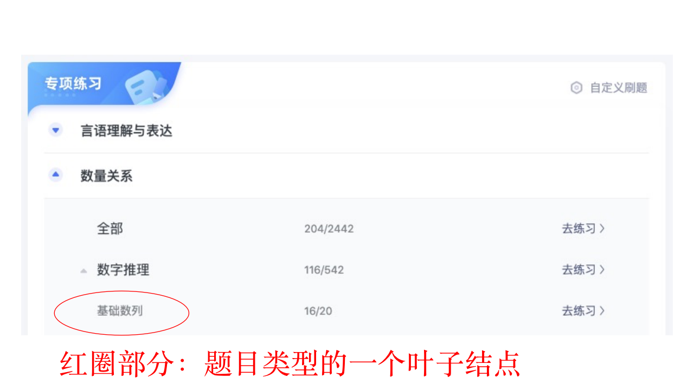
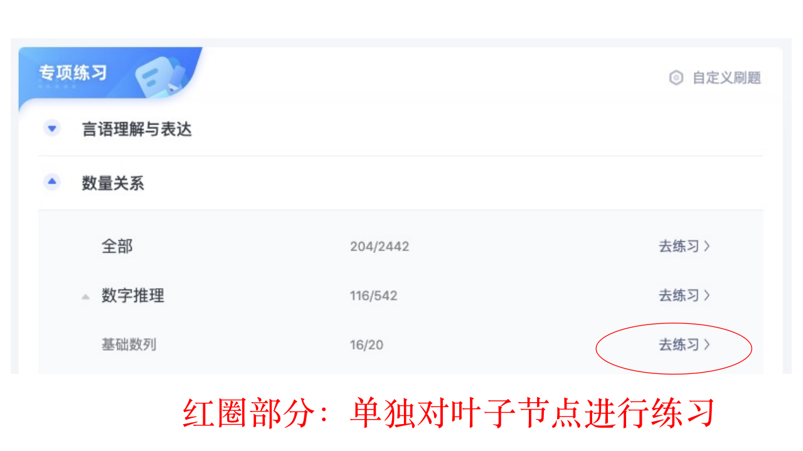
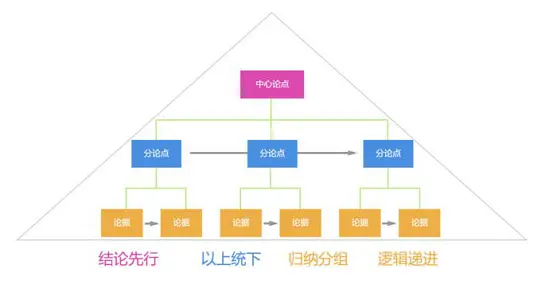

# 步骤
- [公务员篇](#公务员篇)
- [公务员篇详解](#公务员篇步骤详细解释)

# 公务员篇

## 行测
0. 明确要准备的考试，如：广东2021年省考

1. 限时做前一年行测真题并评分，**树立benchmark**，如：[广东2020年省考真题](https://www.fenbi.com/spa/tiku/exam/practice/xingce/xingce/1183500798/3)

2. 标出试卷中每一道题对应的**题目类型的叶子节点**（**题目类型的叶子节点**：[粉笔公考题库](https://www.fenbi.com/spa/tiku/guide/catalog/xingce?prefix=xingce)里划分最为细致的题目类型，如数量关系-数字推理-基础数列）

3. 请一位有考公经验的朋友喝咖啡，一起逐题看试卷，**不设框架地提问**，弄懂自己错在哪里

4. 每个叶子结点做十五道题，做完对答案

5. 15道里对的少于9道，再做15道，直到15道对9道为止；大于等于9道，下一个细分类型

6. 阶段成就：筑基成功！你已经刷完每一个细分类型，且最高准确率大于60%

7. 进备考群/论坛/社区，感受氛围，获取信息，参加讨论与提问，隐去个人信息

8. 掐时间做一套题，对比这次与第一次刷套题的操作上、心理感受上的区别，总结进步的点

9. 打开粉笔的错题记录，带着问题看行测书对应章节

9. 继续按照细分类型做题，每类刷十道，标出正确道数少于9的细分类型，针对性看书

10. 把考试时间减少10分钟，做一套真题

11. 记录在做试卷的时候出现的每一个想法与决策，如：“这道题好难，跳过去”

12. 尽可能参加每一次粉笔的模拟考试

13. 使用粉笔网的错题记录，重做所有错题

14. 临考试之前，宣布考场信息之前，看[b站up主公考现场视频](https://www.bilibili.com/video/BV1qy4y167VW?from=search&seid=755626871186197193)，在脑里模拟考试全流程：起床、收拾东西、坐车、到达考场、等待、进场、考试、交卷

15. 宣布考场信息后，尽快踩点并拍视频，回家在脑里模拟全流程，侧重演练各种异常场景：遇到不会做的题、噪音、旁边的人抖腿和填答题卡时间不够等

## 申论
0. 关注你的读者：根正苗红的公职人员，他们想看到的答案是**符合当代主流价值观且落在实处**

1. 看去年真题，用**树形结构自上而下**地构思自己的答案，限时写答案

2. 看机构的参考答案，对比自己的答案，向已成功考公的朋友提问，提问不设框架，弄清楚作者为什么这么写

3. 拆解参考答案，找出自己大脑不会想到的名词或者句子，理解其意思

4. 限时真题练习3-4篇，试图用到上一步记住的名词或句子，使用粉笔申论批改

5. 根据评语改进自己的答案

6. 练字（长期），直到写的字让别人认为很好看

7. 把自己落进去，写真实的内容

8. 多看题以及按照树形结构自上而下组织答案，对照参考答案看是否有错漏

## 面试

0. **真正明确**[第一印象](http://reader.epubee.com/books/mobile/b0/b0bea497c9f3e613d73b3c220c7918ea/text00007.html)的重要性

1. 若bmi超肥胖线，请开始减肥

2. 打开你的前置摄像头，看去年真题，限时组织答案并真实回答，即使磕磕绊绊甚至答不出来也坚持完成，建立benchmark

3. 看真题解析，学习套路，按金字塔原理组织答案并对照参考答案发现自身不足

4. 组队练习，直到习惯在不同的人面前流畅回答问题

5. 挑选衣服：不浮夸的、有质感的正装，不要弄皱它，多买一件白衬衫

6. 有时间就穿着正装复习、吃饭，尽快习惯它

7. 笔试进面之后报面试班，跟节奏走，抓紧机会在多个人面前练习，找机会给自己录像

8. 处好面试班同学关系，寻找优秀的、能给有效反馈的同学组成小集体，面试班结束后接着练习

9. 看视频，[结构化面试](https://www.bilibili.com/video/BV15C4y1W7XC?from=search&seid=9705480113909886681)、[无领导小组面试](https://www.bilibili.com/video/BV1WT4y1g7ty?from=search&seid=2173110650605898747)，大脑模拟全流程

9. 雕琢细节，进入面试的场地到离开的每一个环节：开门、走路、抽凳子、坐下、微笑、回答、思考、回答、离场，在线联系的时候录像，不断进步

10. 在面试班最后面的安排里，有仿真面试，穿正装走一次流程

## 思维能力测试（行测的变种）
1. 压缩时间做真题逼自己出错来发现问题，10-20分钟甚至更多

2. 记录在做试卷的时候出现的每一个想法与决策，如：“这道题好难，跳过去”

3. 根据第二步暴露的问题，梳理、锤炼自己的做题流程

## 报考
1. 使用公考雷达app筛选自己能报的岗位

2. 选择**限制条件最多**的岗位

3. 查找岗位信息，除了互联网能搜到的信息外，最好找到相同岗位的人咨询

4. 了解这个岗位的上下限、待遇来源、工作强度

5. 开始报名之后先报名，不用纠结

## 体能测试
1. 进行真实的体能测试：跑道跑1000米、只穿袜子摸高、淘宝购买折返跑木块4×10掐秒进行折返跑（建议去所在地👮‍♀️学校，那里有现成的场地）

2. 对齐差距，明确自己还差多远

3. 建立目标，如1000米4分10秒

4. 抖音或者b站学习技巧

5. 坚持锻炼、训练，两天一次；一周一次模拟测试

6. 预防伤病：避免🏀⚽️等不稳定运动，避免在考试前两天进行剧烈运动

7. 大脑预演整个流程

8. 临场带外套长裤保暖，带功能饮料补充能量

## 体检
1. 预检：面试完之后一天，先去三甲医院体检，心中有底。要求裸眼视力的提前预约做全飞秒

2. 体检前：正常作息，清淡饮食

3. 体检时：抽血前不喝水，抽血后及时补充水分

4. 后检：体检完成、原地解散之后，重新在医院做一次所有的体检项目，得知真实指标

## 政审
1. 无犯罪证明：要求严格的单位会查三代直系亲属的无犯罪证明

2. 征信：老赖、被执行人过不了政审

3. 原单位政审

# 公务员篇步骤详细解释
## 行测
0. 明确要准备的考试，如：广东2021年省考

（有清晰可以执行的目标是最为关键的，漫无目的的复习就像为没有详细说明的需求文档做技术方案设计一样。）

1. 限时做前一年行测真题并评分，**树立benchmark**，如：[广东2020年省考真题](https://www.fenbi.com/spa/tiku/exam/practice/xingce/xingce/1183500798/3)

（此处体现了本指南与其他市面上的考公指南最不一样的地方：本指南最大程度上利用了**程序员的职业优势：实践能力极强、好奇心强、学习能力强**，程序员都坚信实践出真知。在开始复习的时候，增加实操经验、建立benchmark是非常关键的。）

2.标出试卷中每一道题对应的**题目类型的叶子节点**（**题目类型的叶子节点**：[粉笔公考题库](https://www.fenbi.com/spa/tiku/guide/catalog/xingce?prefix=xingce)里划分最为细致的题目类型，如数量关系-数字推理-基础数列）

（此步骤能完成对公务员行测知识体系的摸查，不仅让人知道有哪些题目类型，还能把题目类型和真实的题目联系在一起）

3. 请一位有考公经验的朋友喝咖啡，一起逐题看试卷，**不设框架地提问**，弄懂自己错在哪里

（请在此步骤发挥程序员的好奇心，打破沙锅问到底）

4. 每个叶子结点做十五道题，做完对答案

（15道题的设置非常巧妙：一来它能降低门槛，二来能利用碎片时间）

5. 15道里对的少于9道，再做15道，直到15道对9道为止；大于等于9道，下一个细分类型
（建立信心，找出规律）

6. 阶段成就：筑基成功！你已经刷完每一个细分类型，且最高准确率大于60%

7. 进备考群/论坛/社区，感受氛围，获取信息，参加讨论与提问，隐去个人信息

8. 掐时间做一套题，对比这次与第一次刷套题的操作上、心理感受上的区别，总结进步的点

9. 打开粉笔的错题记录，带着问题看行测书对应章节

9. 继续按照细分类型做题，每类刷十道，标出正确道数少于9的细分类型，针对性看书

10. 把考试时间减少10分钟，做一套真题

11. 记录在做试卷的时候出现的每一个想法与决策，如：“这道题好难，跳过去”

12. 参加每一次粉笔的模拟考试，观察自己的所处排行

13. 使用粉笔网的错题记录，重做所有错题

14. 临考试之前，宣布考场信息之前，看[b站现场视频](https://www.bilibili.com/video/BV1qy4y167VW?from=search&seid=755626871186197193)在脑里模拟考试全流程：起床、收拾东西、坐车、到达考场、等待、进场、考试、交卷

15. 宣布考场信息后，马上踩点并拍视频，回家在脑里模拟考试全流程，侧重演练各种异常场景：遇到不会做的题、噪音、旁边的人抖腿和填答题卡时间不够等

## 申论
0. 关注你的读者：根正苗红的公职人员，他们想看到的答案是**符合当代主流价值观且落在实处**

1. 看去年真题，用**树形结构自上而下**地构思自己的答案，限时写答案

（参考《金字塔原理》）
2. 看机构的参考答案，对比自己的答案，向已成功考公的朋友提问，提问不设框架，弄清楚作者为什么这么写

3. 拆解参考答案，找出自己大脑不会想到的名词或者句子，理解其意思

4. 限时真题练习3-4篇，试图用到上一步记住的名词或句子，使用粉笔申论批改

5. 根据评语改进自己的答案

6. 练字（长期），直到写的字让别人认为很好看

7. 把自己落进去，写真实的内容

8. 多看题以及按照树形结构自上而下组织答案，对照参考答案看是否有错漏

## 面试

0. **真正明确**[第一印象](http://reader.epubee.com/books/mobile/b0/b0bea497c9f3e613d73b3c220c7918ea/text00007.html)的重要性

1. 若bmi超肥胖线，请开始减肥

2. 打开你的前置摄像头，看去年真题，限时组织答案并真实回答，即使磕磕绊绊甚至答不出来也坚持完成，建立benchmark

3. 看真题解析，学习套路，按金字塔原理组织答案并对照参考答案发现自身不足

4. 组队练习，直到习惯在不同的人面前流畅回答问题

5. 挑选衣服：不浮夸的、有质感的正装，不要弄皱它，多买一件白衬衫

6. 有时间就穿着正装复习、吃饭，习惯它

7. 笔试进面之后报面试班，跟节奏走，抓紧机会在多个人面前练习，给自己录像

8. 处好面试班同学关系，组成小集体面试班结束后练习

9. 雕琢细节——进入面试的场地到离开的每一个环节：开门、走路、抽凳子、坐下、微笑、回答、思考、回答、离场，在线练习的时候录像，不断进步

10. 大脑模拟全流程

## 思维能力测试（行测的变种）
1. 压缩时间做真题逼自己出错来发现问题，10-20分钟甚至更多

2. 记录在做试卷的时候出现的每一个想法与决策，如：“这道题好难，跳过去”

3. 根据第二步暴露的问题，梳理、锤炼自己的做题流程

## 报考
1. 使用公考雷达app筛选自己能报的岗位

2. 选择**限制条件最多**的岗位

3. 查找岗位信息，除了互联网能搜到的信息外，最好找到相同岗位的人咨询

4. 了解上下限、待遇来源、工作强度

5. 开始报名之后先报名，不用纠结

## 体能测试
1. 进行真实的体能测试：跑道跑1000米、只穿袜子摸高、淘宝购买折返跑木块4×10掐秒进行折返跑（建议去所在地警察学校，那里有画好的线）

2. 对齐差距，明确自己还差多远

3. 建立目标，如1000米4分10秒

4. 抖音或者b站学习技巧

5. 坚持锻炼、训练，两天一次；一周一次模拟测试

6. 预防伤病：避免🏀⚽️等不稳定运动，避免在考试前两天进行剧烈运动

7. 大脑预演整个流程

8. 临场带外套长裤保暖，带功能饮料补充能量

## 体检
1. 预检：面试完之后一天，先去三甲医院体检，心中有底。要求裸眼视力的提前预约做全飞秒

2. 体检前：正常作息，清淡饮食

3. 体检时：抽血前不喝水，抽血后及时补充水分

4. 后检：体检完成、原地解散之后，重新在医院做一次所有的体检项目，得知真实指标

## 政审
1. 无犯罪证明：开不出就过不了。要求严格的单位会查三代直系亲属

2. 征信：老赖、被执行人过不了，参照公务员法
